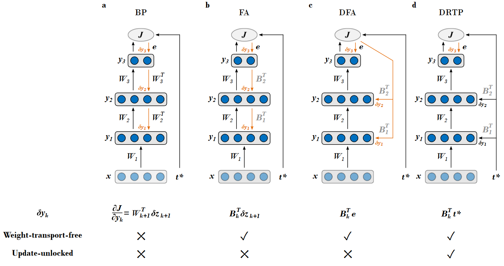

# Direct Random Target Projection (DRTP) - PyTorch-based implementation

> *Copyright (C) 2019, Université catholique de Louvain (UCLouvain), Belgium.*

> *The source code is free: you can redistribute it and/or modify it under the terms of the Apache v2.0 license.*

> *The software and materials distributed under this license are provided in the hope that it will be useful on an **'as is' basis, without warranties or conditions of any kind, either expressed or implied; without even the implied warranty of merchantability or fitness for a particular purpose**. See the Apache v2.0 license for more details.*

> *You should have received a copy of the Apache v2.0 license along with the source code files (see [LICENSE](LICENSE) file). If not, see <https://www.apache.org/licenses/LICENSE-2.0>.*

|  |
|:--:|
| *Fig. 1 - (a) Backpropagation of error algorithm (BP).  (b) Feedback alignment (FA) [Lillicrap et al., Nat. Comms., 2016].  (c) Direct feedback alignment (DFA) [Nokland, NIPS, 2016].  (d) Proposed direct random target projection (DRTP) algorithm.* |

The provided source files contain the PyTorch-based code for training fully-connected and convolutional networks using the following algorithms, as summarized in Fig. 1:
* the backpropagation of error algorithm (BP), 
* feedback alignment (FA) [Lillicrap et al., Nat. Comms., 2016],
* direct feedback alignment (DFA) [Nokland, NIPS, 2016],
* the **proposed direct random target projection (DRTP)** algorithm, which solves both the weight transport and the update locking problems.

In order to reproduce our experiments in the associated paper (see below), the error-sign-based variant of DFA (sDFA) and shallow learning are also available.

In case you decide to use the source code for academic or commercial use, we would appreciate if you let us know; **feedback is welcome**. Upon usage of the source code, **please cite the associated paper** (also available [here](https://arxiv.org/pdf/1909.01311.pdf)):

> C. Frenkel, M. Lefebvre and D. Bol, "Learning without feedback: Direct random target projection as a feedback-alignment algorithm with layerwise feedforward training," *arXiv preprint arXiv:1909.01311*, 2019.

Instructions on how to use the code are available in the [main.py](main.py) source file.
